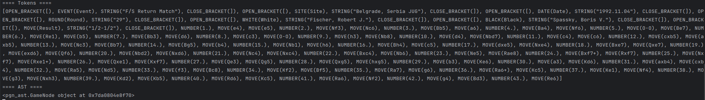

# PGN Chess Game Simulator

## Table of contents

* [Introduction](#introduction)
* [Installation](#installation)
* [Use](#use)
* [Code detail](#code-detail)
* [Conclusion](#conclusion)

## Introduction

Welcome to the PGN chess game simulator project! This project reads a PGN file, translates it into an internal data structure (AST), then simulates the chess game using a graphical interface based on Tkinter and the Chess library. 

## Installation

To install this project, you need to clone the repository from the link provided, then install the necessary dependencies. Make sure you have Python installed on your machine.

```bash
git clone https://github.com/baptiste-lrx/Compilateur-format-pgn.git
pip install -r requirements.txt
```

## Usage

To use this project, run the main project script as follows:
```
python src/analyse_partie.py examples/example1.pgn
```

The project's main script will perform the following operations:

1. Read the PGN file.
2. Perform a lexical and syntactic analysis of the PGN file, creating an abstract syntax tree (AST).
3. Visit the AST to create an internal representation of the chess game.
4. Display the chess game on a graphical interface, allowing navigation through the moves.

## Code details

The project consists of several main components:

1. pgn_lexer.py: This file contains the code for the lexical analysis of the PGN file. It transforms the text of the file into a series of tokens.
2. pgn_parser.py: This file contains the code for parsing the tokens, creating an AST.
3. pgn_visitor.py: This file contains the code to visit the AST and create an internal representation of the chess game.
4. pgn_interface.py: This file contains the code for the graphical interface, which displays the chess game and allows you to navigate through the moves.
5. utils.py: This file contains utility functions to convert moves into the appropriate format for the Chess library.

Here's the graphical rendering Tkinter allows you to use to play the game .pgn :


The tokens remain displayed in the terminal to help you understand the compilation steps:



## Conclusion

This project has been an excellent opportunity to explore the inner workings of text analysis and complex data representation. While working on this project, we were able to deepen our understanding of concepts such as lexical and syntactic parsing, AST creation, AST visitation and GUI creation in Python. We hope you find this project useful and informative!